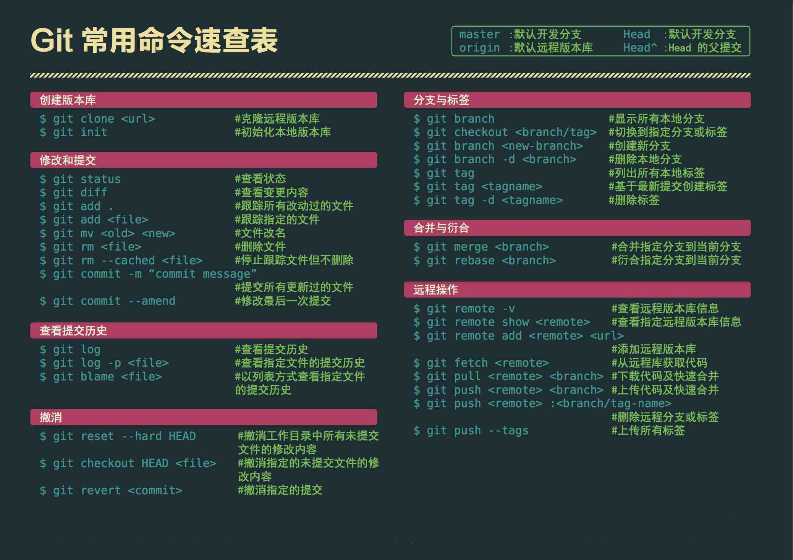
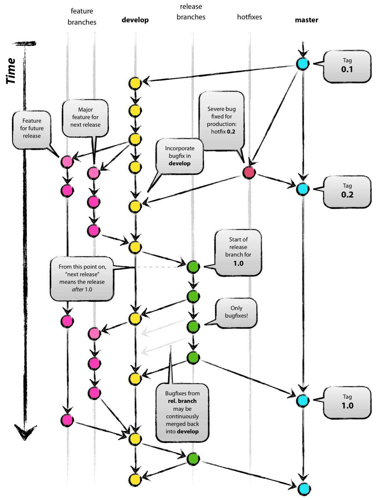

## Git 学习

Git 毋庸置疑是程序员必备的技能，Github 也是一样。

#### [Git](https://github.com/git/git) 学习资源

* [git-scm](https://git-scm.com/)
* [git - 简易指南](https://www.bootcss.com/p/git-guide/)
* [高质量 Git 中文教程](https://github.com/geeeeeeeeek/git-recipes)

#### [Git Flow](https://github.com/nvie/gitflow)

* [A successful Git branching model](https://nvie.com/posts/a-successful-git-branching-model/)
* [git-flow 备忘清单](https://danielkummer.github.io/git-flow-cheatsheet/index.zh_CN.html)

