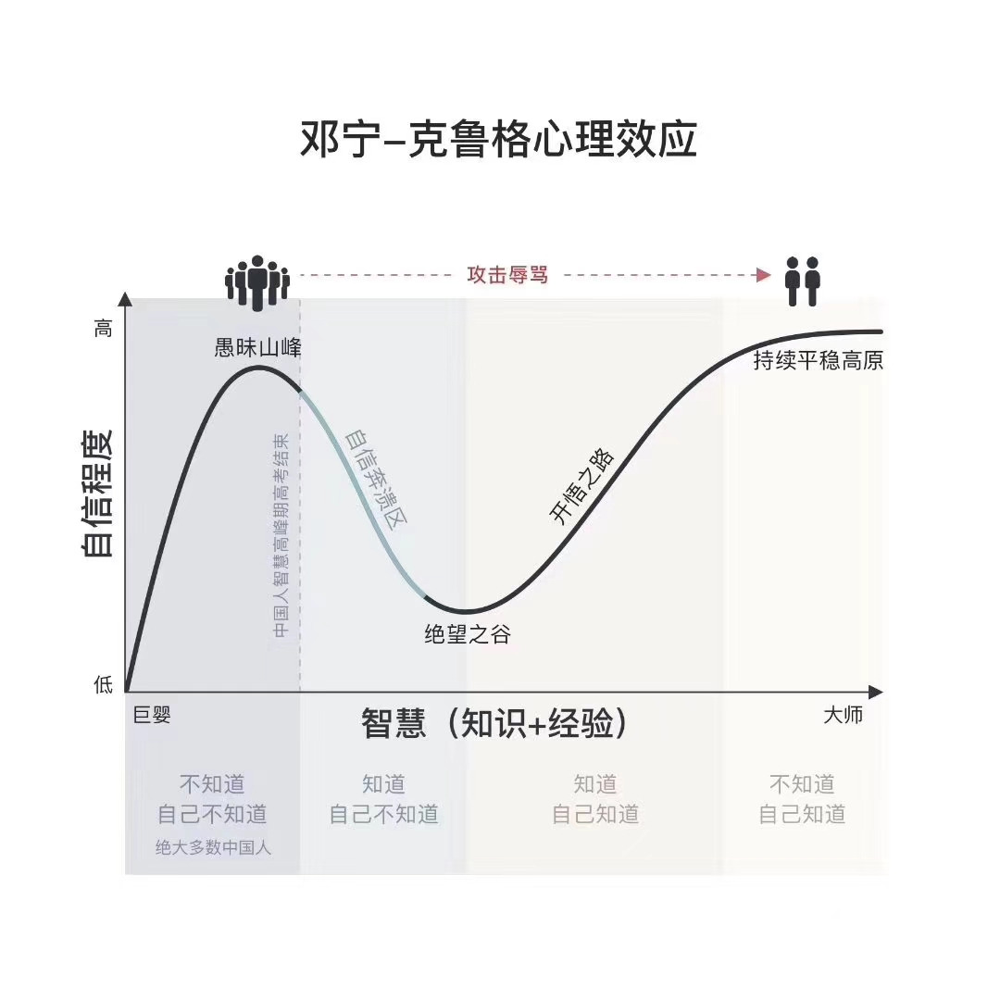

## 认知提升

人生四个阶段

* 巨婴 -> 愚昧山峰：不知道自己不知道
* 愚昧山峰 -> 绝望之谷：知道自己不知道
* 绝望之谷 -> 开悟之路：知道自己知道
* 开悟之路 -> 大师：不知道自己知道

### 傅盛认知三部曲

* [所谓成长就是认知升级](https://mp.weixin.qq.com/s?__biz=MjM5NjgzMzkwMQ==&mid=2653646279&idx=1&sn=c8fa4416124c109adf08d7dfe299d898&chksm=bd3cf2c58a4b7bd3e6670badee497b067bf79d2051bed2c126ac07504431a1b31b7358a7da71&scene=21#wechat_redirect)
* [管理本质就是认知管理](https://mp.weixin.qq.com/s?__biz=MjM5NjgzMzkwMQ==&mid=2653646297&idx=1&sn=886ee0d49cf5661037e8085b91b9ae24&chksm=bd3cf2db8a4b7bcd073661547c33f6b409e6d40abfda68b9e529ce432ec3f3ebb90ecd4b85cd&scene=21#wechat_redirect)
* [战略就是格局+破局](https://mp.weixin.qq.com/s?__biz=MjM5NjgzMzkwMQ==&mid=2653646297&idx=2&sn=5fabdd8025920bf0e3f5f554d5bc65d4&chksm=bd3cf2db8a4b7bcde78b5bc19cfc4cc58977940d7ad03b6c4936bc77c0355125cfcfb768a3af&scene=21#wechat_redirect)
* [到底什么是认知？](https://mp.weixin.qq.com/s?src=3&timestamp=1596808447&ver=1&signature=3gL4zR0XBhVkEZsUgdfTiB-DaMFLZOfZ6IItSz53DHPeHB7FVMLQNlFK9vIWeSL0ZhjDGnq7HFA6jh*IJS1acxNjXWNXky23uqXiPWLbskuQFnsO4QNAuQlanwoLAsB0SC7J89Zw*n*JIJsX1qq2e80zpasBfHNqnWKEe0dRSnA=)
* [一家公司的CEO该如何做战略？](https://mp.weixin.qq.com/s?__biz=MjM5NjgzMzkwMQ==&mid=219005249&idx=1&sn=9a98051b8f28aac574b6afd51577114a&scene=21#wechat_redirect)
* [一家公司CEO该干什么？](https://mp.weixin.qq.com/s?__biz=MjM5NjgzMzkwMQ==&mid=200612121&idx=1&sn=b656c16231c9fe3cd0de76251a1575b8&scene=21#wechat_redirect)

